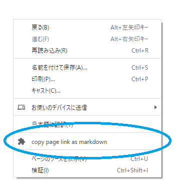

# copy page link as markdown

## What's this?

This is a browser extension for Edge and Chrome that allows you to copy page links from the right-click menu to the clipboard in Markdown format.



## Verified browser versions

|    browser     |     version     |
| -------------- | --------------- |
| Microsoft Edge | `85.0.564.51`   |
| Google Chrome  | `85.0.4183.102` |

## Usage

#### 1. download extension

```sh
git clone https://github.com/loftkun/copy-page-link-as-markdown.git
```

#### 2. open browser extensions page

- chrome://extensions/
- edge://extensions/

#### 3. enable `Developer mode`

You can find `Developer mode` toggle switch in the corner of the extension page.

#### 4. load extension.

Press `Load unpacked extension` buttons to load the extension directory.

the button names  in Japanese below:

- `パッケージ化されていない拡張機能を読み込む` (Chrome)
- `展開して読み込み` (Edge)
